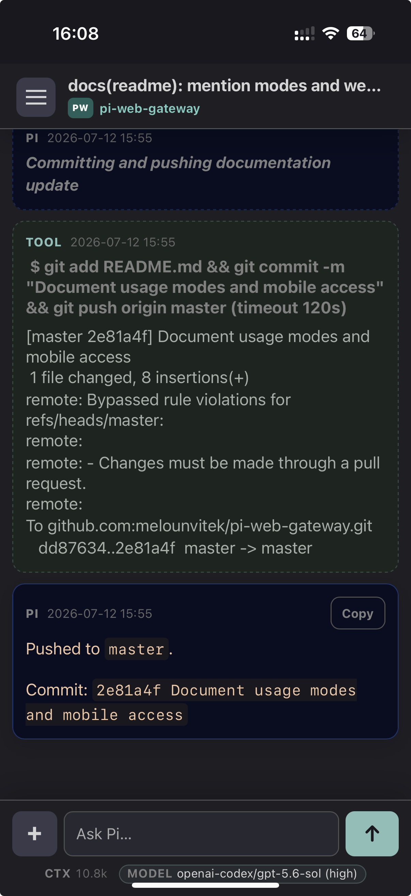

# Pi Web Gateway

Browser UI for local Pi sessions.




I'm scared to look into the code (the project is my attempt to try real vibe-coding), but it works nicely!

## Features

- Browse, resume, and start Pi sessions from the browser
- Use locally or over a private VPN such as Tailscale
- Supports many native Pi slash commands, including `/tree`, `/compact`, and custom skills
- Install as a desktop app or mobile web app

## Status and security

Pi Web Gateway runs Pi locally through a browser UI. Use it only on your own machine or trusted private networks.

Do not expose it directly to the public internet. Approved browsers can view sessions and start Pi processes with the same local filesystem, repository, and credential access as the gateway process.

## Requirements

- [mise](https://mise.jdx.dev/)
- [Pi CLI](https://pi.dev/) available on `PATH`

## Setup

```sh
git clone https://github.com/melounvitek/pi-web-gateway.git
cd pi-web-gateway
mise trust
mise install
mise run setup
```

The setup task installs Ruby dependencies and creates a local config file at `~/.config/pi-web-gateway/env` if needed. If no admin password is configured, it generates one and prints it once.

## Run

```sh
PI_GATEWAY_HOST=127.0.0.1 mise run start
```

Open <http://localhost:4567>.

For local, VPS, and mixed setups, see [example setups](docs/examples.md).

## Install as an app

Desktop:

```sh
mise run desktop-install
```

The desktop app connects to a running gateway server.

Mobile:

- iPhone/iPad: use Safari and “Add to Home Screen”
- Android: use Chrome and install/add to home screen

## Configuration

Edit `~/.config/pi-web-gateway/env` for local settings.

```sh
PI_BROWSER_AUTH_DISABLED=1
PI_MULTI_USER_MODE=1
```

Pass `PI_GATEWAY_HOST` or `PI_GATEWAY_PORT` when starting the server. See [configuration](docs/configuration.md) for details and advanced options.

## Optional Pi setup

Pi Web Gateway uses native Pi session names when available. If you do not already have your own session-naming workflow, consider installing the [`@furbyhaxx/pi-session-naming`](https://github.com/furbyhaxx/pi-session-naming) Pi package:

```sh
pi install npm:@furbyhaxx/pi-session-naming
```

## Note

This project is written in Ruby, because I am a Ruby developer trying full vibe-coding for the first time, and I expected I might need to jump in. It turned out that was not needed, so I have mostly stayed out of the generated code -- so please, do not treat it as a sample of my usual Ruby style. It very likely is not :-).


## Development

```sh
mise run dev
mise run test
```
