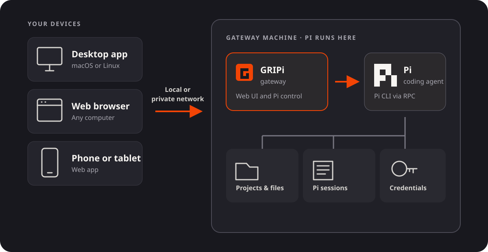
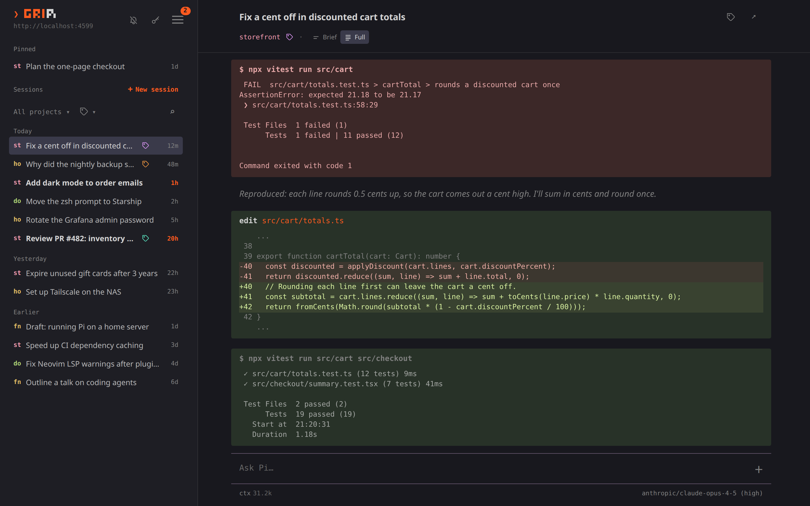
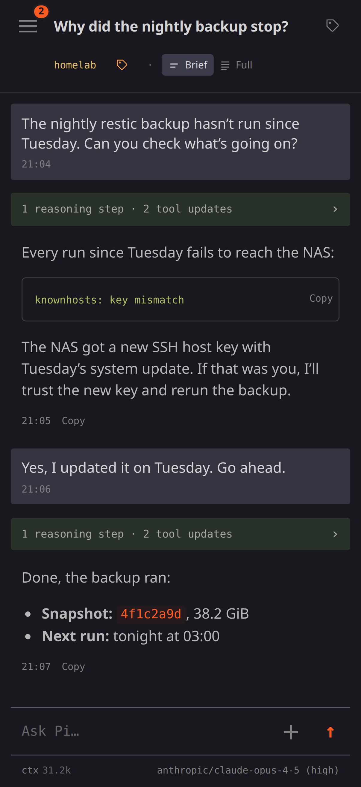

<p align="center">
  <picture>
    <source media="(prefers-color-scheme: dark)" srcset="branding/gripi-wordmark-dark.svg">
    
  </picture>
</p>

**Gripi is a desktop and web interface for [Pi](https://pi.dev/), served by a self-hosted gateway.** Run the gateway on a development machine or home server with Pi CLI installed, then use Pi from the desktop app or a web browser, on the same machine or over an encrypted private network.

**Pi stays Pi.** Gripi does not alter Pi’s system prompt, patch Pi, install extensions, rewrite sessions, or change Pi-owned configuration. It works with the Pi setup you already have. The only addition is a small Gripi extension, loaded into each Pi process with `--extension`, that gives the browser access to Pi’s session tree.

<p align="center">
  <strong><a href="https://gripi.w10.cz/">Try the live interactive demo →</a></strong><br>
  <sub>No installation required. Responses and backend actions are simulated.</sub>
</p>

<a href="docs/images/gripi-architecture.svg"></a>

> The project is a fully vibe-coded alpha version at the moment. Initially, it was supposed to be a quick proof of concept, but I ended up using it for my daily work and I actually like it. So please, feel free to try it; but expect some rough edges, missing features, and behavior that may change. Happy to look at any feedback (use GitHub issues)!

## Features

- All Pi sessions on the gateway machine in one sidebar, with search, project and tag filters, pinning, and unread markers.
- A Pi-style composer with slash commands, `@` file completion, `!` shell commands, and image attachments.
- Steer Pi or queue follow-ups while it is running.
- A Brief view that collapses tool calls, results, and thinking into summaries.
- Find in conversation, model and thinking settings, and context usage.
- Notifications when replies finish, including Web Push on phones.
- A [`gripi` command](#command-line) that lets scripts and agents list sessions, send messages, and wait for replies.
- Saved [environment variables](docs/configuration.md#environment-variables) for Pi and every command it runs, such as your own GitHub token on a shared gateway.

## Install

Requirements:

- A Linux or macOS machine for the gateway, with `curl` and Git.
- [Pi CLI](https://pi.dev/) on `PATH`, already working, authenticated, and configured for the OS user that runs the gateway. Gripi does not install or configure Pi.

### Gateway

```sh
bash -o pipefail -c 'curl -fsSL https://raw.githubusercontent.com/melounvitek/gripi/master/bin/install | bash -s -- gateway'
```

<details>
<summary>What it does</summary>

1. Downloads and runs Gripi’s current installer from the `master` branch.
2. Checks that Git is available.
3. Installs [Mise](https://mise.jdx.dev/) to `~/.local/bin/mise` from its official installer if `mise` is not already available.
4. Clones Gripi into a temporary directory.
5. Uses Mise to install Gripi’s pinned Go and Node.js versions.
6. Installs Node dependencies, builds the Go gateway, and ensures an admin password exists in `~/.config/gripi/env`. A newly generated password is printed.
7. Moves the completed checkout to `~/.local/share/gripi`. It refuses to overwrite an existing installation.

It does not install or configure Pi, and it does not start the gateway.

</details>

Start the gateway:

```sh
~/.local/share/gripi/bin/start
```

It runs in the foreground, and Ctrl+C stops it. The gateway listens only on `127.0.0.1:4567` by default. Open <http://localhost:4567> and approve the browser with the admin password printed by the installer. It is saved as `GRIPI_ADMIN_PASSWORD` in `~/.config/gripi/env`.

To use the gateway from other devices, or keep it running with systemd, see [local and remote setups](docs/examples.md).

### Desktop app

The desktop app is installed separately from the gateway and supports macOS and Linux. It requires `curl` and Git; on Linux, it also requires FUSE 2 (`fuse2` on Arch Linux).

```sh
bash -o pipefail -c 'curl -fsSL https://raw.githubusercontent.com/melounvitek/gripi/master/bin/install | bash -s -- desktop'
```

<details>
<summary>What it does</summary>

1. Downloads and runs Gripi’s current installer from the `master` branch.
2. Checks that Git is available.
3. Installs [Mise](https://mise.jdx.dev/) to `~/.local/bin/mise` from its official installer if `mise` is not already available.
4. Clones Gripi into a temporary directory.
5. Uses Mise to install the pinned Node.js version and build the Electron desktop app.
6. Installs or replaces `Gripi.app` under `~/Applications` on macOS, or installs and registers the AppImage under the user’s XDG data directories on Linux.
7. Removes the temporary checkout. It does not install the gateway.

</details>

The app connects to <http://localhost:4567> by default. Use **File → Add Server…** to add other gateways and **File → Next Server** (Ctrl+Tab) to switch between them. Pi always runs on the selected gateway machine.



### Phone

There is no mobile app. On iPhone, open the gateway in Safari, tap **Share**, choose **Add to Home Screen**, turn on **Open as Web App**, and tap **Add** ([Apple’s guide](https://support.apple.com/guide/iphone/open-as-web-app-iphea86e5236/ios)). On iOS/iPadOS 16.4 or newer, the Home Screen app can receive [Web Push notifications](docs/configuration.md#web-push-notifications) for finished replies, even while it is closed. Notifications require HTTPS, such as [Tailscale Serve](docs/examples.md#https-through-tailscale-serve).



## Command line

Scripts and agents on the gateway machine can work with sessions through the `gripi` command:

```sh
gripi list                                # sessions with their live state
gripi send 01a107aa "Run the tests"       # prompt a session
gripi wait 01a107aa --timeout 900 --json  # block until it stops working
gripi show 01a107aa                       # print the reply
```

Other commands start a session (`new`), stop what one is working on (`stop`), continue one in Pi CLI (`open`), pin or tag sessions (`pin`, `unpin`, `tag`, `untag`, `tags`), and delete one (`delete`). `gripi help` describes every command, and all of these but `open` can print JSON. The gateway must be running, and not in [multi-user mode](docs/configuration.md#multi-user-mode).

When `bin/start` starts the gateway installed at `~/.local/share/gripi`, it links the command into `~/.local/bin`, unless something there is already named `gripi`. `~/.local/bin` must be on your `PATH`.

## Updating

The gateway shows an update control in the sidebar when a new version is available. It builds the update and checks it against your Pi before installing it, then restarts. See [self-updates](docs/configuration.md#self-updates) for the requirements.

To update manually, stop the gateway and run:

```sh
cd ~/.local/share/gripi && git pull --ff-only && mise run setup
```

Then start it again. `mise run setup` rebuilds the gateway; without it, `bin/start` keeps running the old build.

To update the desktop app, run its installer again.

## Uninstalling

Stop the gateway and remove any systemd unit or `tailscale serve` configuration you added. Then delete:

- `~/.local/share/gripi`: the gateway.
- `~/.local/bin/gripi`: the link to its command.
- `~/.config/gripi`: settings, including the admin password.
- `~/.pi/gripi`: Gripi’s own data, such as approvals, tags, pins, and uploaded attachments.

Pi’s sessions and settings in `~/.pi/agent` are not affected. If the installer installed Mise and you no longer need it, also delete `~/.local/bin/mise`.

To remove the desktop app, delete `~/Applications/Gripi.app` on macOS. On Linux, delete `~/.local/share/gripi-desktop` and `~/.local/share/applications/gripi.desktop`.

## Security

Anyone who can use Gripi can run shell commands as the gateway’s OS user, with that user’s files, credentials, environment, and network access. Therefore:

- Do not expose the gateway directly to the public internet.
- For remote access, use HTTPS or an encrypted VPN such as Tailscale. Plain HTTP over a LAN or Wi-Fi can expose passwords and access cookies, so Gripi rejects remote plain HTTP unless you [explicitly allow it](docs/configuration.md#server-address) for a VPN.
- Keep access approval enabled for any gateway reachable from another device. Only [disable it](docs/configuration.md#disabling-approval) when the network already limits access to trusted devices and users.
- Only open projects you trust. Gripi [loads project resources automatically](#differences-from-pi-cli).

In the default single-user mode, every new browser must be approved once, either with the admin password or from a browser that is already approved. See [access approval](docs/configuration.md#access-approval) to change the password or remove a browser.

Programs that already run as the gateway’s OS user need no approval. The [`gripi` command](#command-line) reaches the gateway through a socket that only that user can open.

Optional [multi-user mode](docs/configuration.md#multi-user-mode) gives each user a private token and shows them only their own sessions. It is intended for users who trust each other: all users still run commands as the same OS user, and they share model and thinking settings. Each user can save their own [environment variables](docs/configuration.md#environment-variables), for example to use their own GitHub account. These are not secret between users.

## Differences from Pi CLI

Gripi uses Pi’s own runtime, sessions, tools, models, and configuration. The composer works like Pi CLI’s editor: while Pi is running, Enter steers and Alt+Enter queues a follow-up. It differs from Pi CLI in these ways:

- **Project resources load automatically.** Gripi starts Pi with `--approve`, so project settings, extensions, skills, prompts, themes, system prompts, and packages work without first trusting the directory in Pi CLI. As a result, opening a project can run its extensions or package installation scripts. Only open projects you trust, or [turn this off](docs/configuration.md#project-resource-approval).
- **The send button steers by default.** Use its menu to queue a follow-up instead. Prompt templates and skills use the selected mode, extension commands run immediately, and built-in commands sent in Steer mode run as controls rather than messages.
- **Shell output appears when the command finishes.** `!command` adds its output to the model context, and `!!command` does not. Output is not streamed. If a shell command and Pi are both running, Stop cancels the shell command first; press it again to stop Pi.
- **Extension UI is partial.** Select, confirm, input, editor, notify, title, and editor-prefill requests work. Extension status text is not shown in the footer, which shows only the model, thinking level, and context usage.
- **There is no terminal UI.** For custom TUI components, terminal keybindings, or code that checks `ctx.mode === "tui"`, use Pi CLI.
- **Sessions in use in Pi CLI are hidden from the sidebar** until you show them with the terminal button beside search. Each browser remembers the choice, and Ctrl+K still finds them. Pinned and tagged sessions always show.
- **Saved environment variables stay in Gripi.** Pi CLI in a terminal does not get the [environment variables](docs/configuration.md#environment-variables) you save in Gripi, so a session continued there runs without them.

## Development

The gateway is written in Go. The browser UI and demo use plain JavaScript with no build step, and the desktop app uses Electron. Pi CLI must be on `PATH`; setup does not install it.

```sh
git clone https://github.com/melounvitek/gripi.git
cd gripi
mise install
mise run setup
mise run dev
```

`mise run dev` serves the gateway in development mode on <http://localhost:4567>. It uses the same port, settings, and Gripi data as an installed gateway, so stop that one first. Run the main checks with `mise run test`. See [testing](docs/testing.md) for the other checks and the browser suite, [frontend architecture](docs/frontend.md) for how the UI is organized, and [configuration](docs/configuration.md) for all settings.
